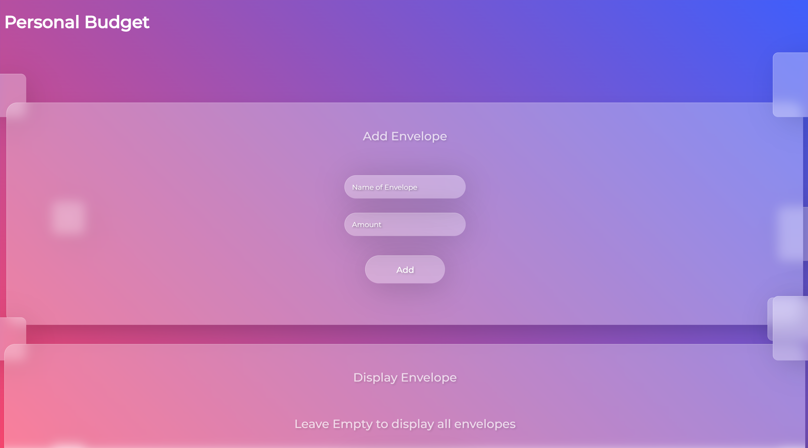

# Personal Budget

Budgeting WebApp API that uses the envelope budgetting method. Includes a default savings 
envelope that stores money left-over when a new monthly income is added. 

## Table of contents

* [General info](#general-info)
* [Screenshot](#screenshot)
* [Technologies](#technologies)
* [Languages](#languages)
* [Features](#features)
* [Inspiration](#inspiration)

## General info

 This is a challenge project set as part of the Codecademy Back-End Engineer career path course.

 ## Screenshot

## Technologies

* Node and Node Package Manager
* Git & GitHub
* HTML
* CSS
* Express

## Languages

* JavaScript

## Status

Project is: COMPLETE

## Inspiration

Project created as part of Codecademy Full-Stack Engineer career pathway.

